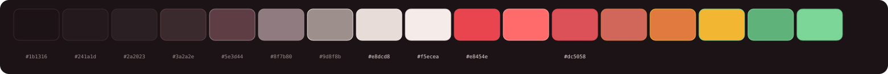

# Midnight Madras

A warm midnight theme for OpenCode with chili-red accents, inspired by the colors and energy of Madras (Chennai) - midnight skies, chili red, turmeric gold, and cardamom green.



## Features

- **Chili-red accent system** - primary, accent, and syntax keywords share a cohesive warm red family
- **Spice-inspired palette** - turmeric strings, marigold numbers, terracotta variables, cardamom-green diffs
- **100% WCAG AA compliant** - every critical color pair passes 4.5:1 contrast
- **Soft midnight base** - warm near-black backgrounds reduce glare without losing depth
- **Semantic token mapping** - consistent colors across UI, markdown, diffs, and syntax
- **Optimized for truecolor terminals**

## Installation

### For LLM Agents

Paste this into your LLM agent (OpenCode, Claude Code, Cursor, etc.):

```
Install the Midnight Madras theme for OpenCode by following the instructions here:
https://github.com/jashjacob/opencode-midnight-madras-theme
```

The agent will read this README, download the theme JSON, and install it to `~/.config/opencode/themes/`.

### For Humans

```bash
mkdir -p ~/.config/opencode/themes
curl -o ~/.config/opencode/themes/midnight-madras.json https://raw.githubusercontent.com/jashjacob/opencode-midnight-madras-theme/main/.opencode/themes/midnight-madras.json
```

Or copy the file from this repo:

```bash
cp .opencode/themes/midnight-madras.json ~/.config/opencode/themes/
```

## Usage

1. Open OpenCode
2. Type `/theme` and select **midnight-madras**
3. Or set it in your `opencode.json`:

```json
{
  "$schema": "https://opencode.ai/config.json",
  "theme": "midnight-madras"
}
```

### Terminal Requirements

For best results, ensure your terminal supports **truecolor** (24-bit color):

- Check support: `echo $COLORTERM` (should output `truecolor` or `24bit`)
- Enable if needed: `export COLORTERM=truecolor`

Most modern terminals (iTerm2, Alacritty, Kitty, Windows Terminal, GNOME Terminal) support this by default.

## Color Palette

| Color Name | Hex | Description |
|---|---|---|
| midnightBg | `#1b1316` | Warm midnight background |
| midnightPanel | `#241a1d` | Elevated panel background |
| midnightElement | `#2a2023` | Interactive element background |
| midnightBorder | `#3a2a2e` | Subtle borders |
| midnightBorderActive | `#5e3d44` | Active/focused borders |
| midnightTextDim | `#8f7b80` | Muted secondary text |
| midnightTextMuted | `#9d8f8b` | Muted text |
| midnightText | `#e8dcd8` | Primary text |
| midnightOffWhite | `#f5ecea` | Bright text / code blocks |
| midnightChili | `#e8454e` | Chili red (primary) |
| midnightChiliBright | `#ff6b6b` | Bright red (accent/errors) |
| midnightBurgundy | `#dc5058` | Deep red (secondary) |
| midnightTerracotta | `#d1665a` | Terracotta (variables) |
| midnightMarigold | `#e07a3f` | Marigold (numbers) |
| midnightTurmeric | `#f2b632` | Turmeric (strings/warnings) |
| midnightCardamom | `#5fb37a` | Cardamom green (success/diffs) |
| midnightCardamomBright | `#7bd697` | Bright cardamom (diff highlight) |

## Theme Token Mapping

| Token | Color |
|---|---|
| primary | chili red `#e8454e` |
| secondary | burgundy `#dc5058` |
| accent | bright red `#ff6b6b` |
| error / info | bright red `#ff6b6b` |
| warning | turmeric `#f2b632` |
| success | cardamom green `#5fb37a` |
| text | warm off-white `#e8dcd8` |
| textMuted | `#9d8f8b` |
| background | `#1b1316` |
| backgroundPanel | `#241a1d` |
| backgroundElement | `#2a2023` |
| border | `#3a2a2e` |
| borderActive | `#5e3d44` |

### Syntax

| Token | Color |
|---|---|
| comment | dim `#8f7b80` |
| keyword / operator | bright red `#ff6b6b` |
| function | coral `#ff9e9e` |
| variable | terracotta `#d1665a` |
| string | turmeric `#f2b632` |
| number | marigold `#e07a3f` |
| type | chili red `#e8454e` |
| punctuation | muted `#9d8f8b` |

### Diffs

| Token | Color |
|---|---|
| added | cardamom green `#5fb37a` |
| removed | bright red `#ff6b6b` |
| context | dim `#8f7b80` |
| added bg | `#22261e` |
| removed bg | `#2a1a1d` |

## WCAG AA Compliance

All 28 critical color pairs pass the WCAG AA 4.5:1 contrast threshold.

| Pair | Ratio | Status |
|---|---|---|
| text on background | 13.60:1 | PASS |
| text on backgroundPanel | 12.62:1 | PASS |
| text on backgroundElement | 11.78:1 | PASS |
| inputText on inputBackground | 15.69:1 | PASS |
| markdownCodeBlock on background | 15.69:1 | PASS |
| textMuted on background | 5.85:1 | PASS |
| textMuted on backgroundPanel | 5.43:1 | PASS |
| textMuted on backgroundElement | 5.07:1 | PASS |
| primary on background | 4.68:1 | PASS |
| secondary on background | 4.63:1 | PASS |
| accent on background | 6.57:1 | PASS |
| error on background | 6.57:1 | PASS |
| warning on background | 10.00:1 | PASS |
| success on background | 7.14:1 | PASS |
| info on background | 6.57:1 | PASS |
| syntaxComment on background | 4.61:1 | PASS |
| syntaxKeyword on background | 6.57:1 | PASS |
| syntaxFunction on background | 9.24:1 | PASS |
| syntaxVariable on background | 5.00:1 | PASS |
| syntaxString on background | 10.00:1 | PASS |
| syntaxNumber on background | 6.10:1 | PASS |
| syntaxType on background | 4.68:1 | PASS |
| syntaxOperator on background | 6.57:1 | PASS |
| syntaxPunctuation on background | 5.85:1 | PASS |
| diffAdded on background | 7.14:1 | PASS |
| diffRemoved on background | 6.57:1 | PASS |
| diffContext on background | 4.61:1 | PASS |
| inputPrompt on inputBackground | 6.57:1 | PASS |

**Result: 100% WCAG AA compliance (28/28 pairs pass 4.5:1).**

## License

MIT License - see [LICENSE](./LICENSE).

## Acknowledgments

- Inspired by [opencode-ai-poimandres-theme](https://github.com/ajaxdude/opencode-ai-poimandres-theme) for the theme structure
- Named after Madras (Chennai), India - midnight skies and spice-market colors